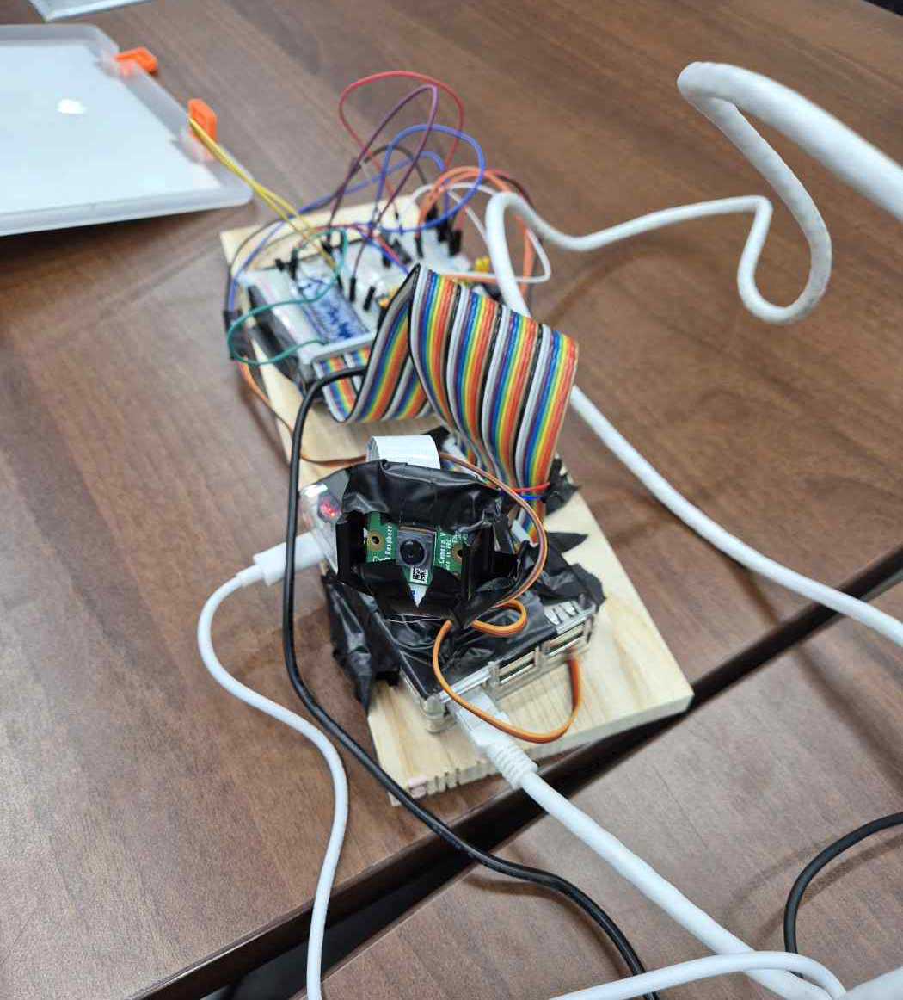
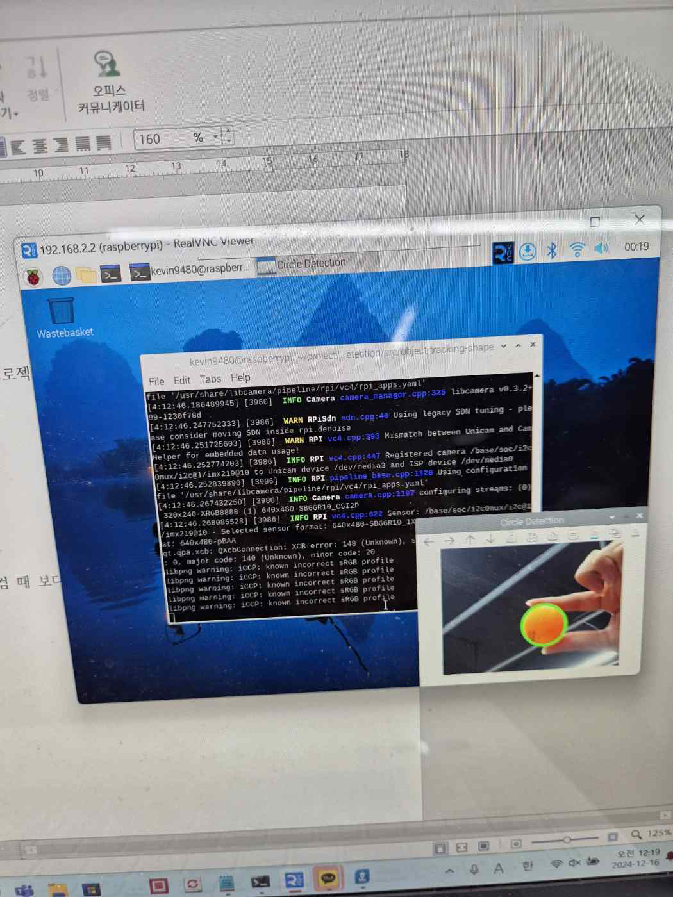

# Raspberry Pi Ball Tracking System

임베디드 시스템 설계 기말프로젝트 — 카메라로 공을 검출하고, 팬틸트(Pan-Tilt) 서보를 PID로 제어해 공을 실시간으로 추적하는 시스템입니다.

## 개요

- 라즈베리파이 카메라로 영상을 받아 OpenCV `HoughCircles`로 공을 검출합니다.
- 검출된 공의 중심 좌표와 화면 중앙 사이의 오차를 계산해, PID 제어로 팬틸트 서보 모터(X축/Y축)를 움직여 공을 화면 중앙에 유지합니다.

## 하드웨어 구성



라즈베리파이 + 카메라 모듈 + 팬틸트 서보 모터 2개(GPIO 17: Pan, GPIO 27: Tilt)로 구성했습니다.

## 동작 파이프라인

```
Camera → 전처리(Blur, Grayscale, CLAHE) → HoughCircles 원 검출
       → 중심 오차 계산 → PID 제어 → 서보 duty cycle 조정 → Pan/Tilt 서보 구동
```

| 항목 | 값 |
|---|---|
| 해상도 | 320 × 240 |
| 목표 FPS | 60 |
| HoughCircles dp | 1.2 |
| minDist | 30 |
| Canny 상단 임계값 (param1) | 135 |
| 원 검출 임계값 (param2) | 55 |
| 검출 반경 범위 | 10 ~ 50 px |

CLAHE(Contrast Limited Adaptive Histogram Equalization)로 명암 대비를 보정해 조명이 고르지 않은 환경에서도 원 검출이 안정적으로 되도록 했습니다.

## 원 검출 (Circle Detection)

CLAHE(Contrast Limited Adaptive Histogram Equalization) 전처리와 HoughCircles 파라미터 튜닝을 통해, 공 형태에 맞춰 원이 정확하게 검출되는 것을 확인했습니다.



## PID 제어

오차(공 중심 - 화면 중심)에 비례하는 P 제어만 사용했고(I, D는 0), 서보가 급격히 움직여 오버슈트하지 않도록 한 스텝당 duty cycle 변화폭을 ±0.2로 제한했습니다. 서보의 물리적 가동 범위를 보호하기 위해 X축은 `3~12`, Y축은 `7~12` 범위로 duty cycle을 클램핑했습니다.

```python
def calculate_pid(error, integral, differential, prev_error, P, I, D):
    integral += error
    differential = error - prev_error
    pid_output = P * error + I * integral + D * differential
    return round(pid_output, 2), integral, differential
```

전체 코드는 [`ball_tracking.py`](ball_tracking.py)를 참고해주세요.

## 결과

공을 화면 안에서 움직이면 팬틸트 서보가 실시간으로 따라가며 화면 중앙에 공을 유지하는 것을 확인했습니다.

## 실행 환경

| 항목 | 내용 |
|---|---|
| 보드 | Raspberry Pi |
| 언어 | Python 3 |
| 라이브러리 | OpenCV(`cv2`), `RPi.GPIO`, `numpy` |
| 카메라 | Raspberry Pi Camera Module |
